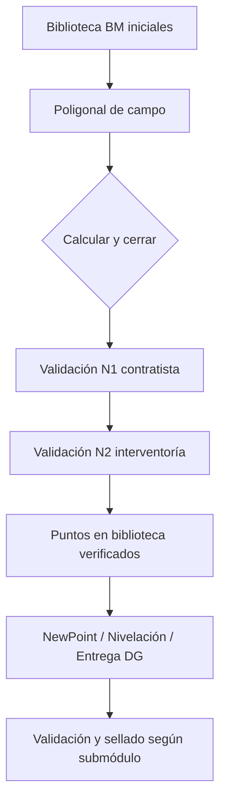
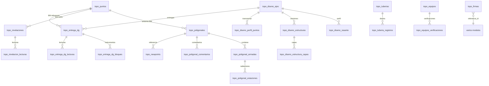

# Módulo de Topografía — Estado actual (ClaraCore)

**Fecha de referencia:** junio 2026  
**Alcance:** documentación del comportamiento implementado hoy. No incluye diseño de mejoras futuras.

---

## 1. Descripción general y propósito

El módulo de **Topografía** es un subsistema operativo de ClaraCore orientado a la **captura, cálculo, validación y trazabilidad de información topográfica de obra** en contratos de infraestructura vial y afines (Colombia).

### Rol dentro de la plataforma

- Centraliza **puntos de referencia verificados** (biblioteca) que alimentan circuitos posteriores (nivelación, amarres, entrega de diseño geométrico).
- Permite levantamientos de **poligonal trigonométrica**, **NewPoint** (resección), **nivelación geométrica**, **diseño geométrico de vía (DG)** y **seguimiento de entrega en obra** por capas.
- Incluye herramientas complementarias: **tubería**, **áreas por coordenadas** y **control de equipos**.
- Se integra con **SICOE Obra**: la aprobación en N2 de reportes puede exigir que el reporte tenga al menos un punto topográfico registrado (`so_puntos_topograficos`), salvo excepción por contrato.
- Está documentado para el asistente **AVI (Clara)** en `backend/avi_prompt.py` (slug `topografia`).

### Arquitectura técnica (resumen)

| Capa | Ubicación principal |
|------|---------------------|
| Frontend | `frontend/src/components/topografia/` |
| Utilidades FE | `frontend/src/utils/topografia_*.js`, `disenoGeometricoParse.js`, `entrega_dg_bloques.js` |
| API REST | `backend/topografia_routes.py` montado en `/topografia` (`backend/main.py`) |
| Lógica de dominio | `topografia_utils.py`, `topografia_diseno_utils.py`, `topografia_entrega_utils.py` |
| Permisos | `topografia_permissions.py` |
| Esquema BD | `backend/sql/topo_create_tables.sql` + migraciones `topo_migration_*.sql` |
| Tests backend | `test_newpoint_*.py`, `test_nivelacion_geom.py` |

El módulo es **independiente por contrato**: todas las tablas llevan `contrato_id` y los endpoints exigen acceso al contrato activo del usuario.

---

## 2. Funcionalidades implementadas

### 2.1 Biblioteca de puntos (`topo_biblioteca`)

- Consulta de todos los puntos del contrato con filtros por tipo y estado verificado/pendiente.
- Los puntos pueden crearse manualmente o **publicarse automáticamente** al aprobar en N2 una poligonal sellada, un NewPoint validado o una nivelación cerrada y aprobada.
- Campos clave: nombre, N/E, cota, tipo (`BM`, `estacion`, `auxiliar`, `PI`, `cambio`), `verificado`, `modulo_origen`, operador y fecha de campo.
- Solo puntos **verificados** pueden usarse como amarres en poligonales/nivelaciones y como referencia en entrega DG.

### 2.2 Poligonal trigonométrica (`topo_poligonal`)

- Circuitos **abiertos** o **cerrados** con libreta de campo por **armadas** (estación + visado + HI).
- Radiación de estaciones: ángulo, distancia, coordenadas, correcciones y ajuste por mínimos cuadrados.
- Cálculo de cierre lineal, angular y de cota; tolerancia relativa configurable (p. ej. 1:3000).
- Flujo: borrador → calcular → cerrar (terminada) → validación N1 contratista → validación N2 interventoría → **sellado** y publicación en biblioteca.
- Comentarios de validación con etiquetas (estilo SICOE simplificado).
- Exportación **PDF** del acta de poligonal.
- Firma digital (perfil de usuario o captura en formulario).
- Gráfico planimétrico y tabla de cálculo ajustada.

### 2.3 NewPoint (`topo_newpoint`)

- **Resección** desde puesto arbitrario hacia dos puntos verificados de una **poligonal sellada**.
- Entrada: distancias a P1/P2, ángulo observado P1→P2, referencia 00.0000 hacia P1.
- Resuelve **dos opciones** (A/B); el operador elige la definitiva antes de validar.
- Validación en dos niveles; al aprobar N2 publica el punto en biblioteca.
- Exportación PDF y gráfico de intersección.
- Reemplaza el flujo legacy de `topo_intersecciones` (tabla aún existe; UI eliminada).

### 2.4 Circuito de nivelación (`topo_nivelacion`)

- Circuitos **abiertos** o **cerrados** con lecturas V+/V-/Vi (modelo geométrico ampliado).
- Tipos de nivel: automático / electrónico; contranivelación: circuito o directa.
- Vinculación opcional de lecturas a puntos de biblioteca; hilos superior/medio/inferior.
- Metadatos de abscisa en lecturas (migración `topo_migration_nivelacion_abscisa.sql`).
- Cálculo de error de cierre (mm/km), tolerancia, ajuste de cotas.
- Cierre, finalización, validación N1/N2, firma y PDF.
- Gráfico de perfil longitudinal del circuito.

### 2.5 Configuración DG — Diseño geométrico (`topo_diseno_geometrico`)

- **Ejes** por contrato con importación de rasante (CSV/Excel) y plantilla descargable.
- Esquemas transversales **A / B / C**, ancho de vía, ordenadas intermedias e interpolación de abscisas.
- **Estructuras de vía versionadas** (`topo_diseno_estructuras`): capas de arriba abajo con espesores, sobre-ancho transversal y referencia de análisis entre capas.
- Generación de **puntos de perfil transversal** (`topo_diseno_perfil_puntos`) a partir del diseño.
- Vista previa de cota de diseño por capa.

### 2.6 Entrega DG Obra (`topo_entrega_dg`)

- Seguimiento en campo por **eje + capa** (incluye pseudo-capa «Terreno natural»).
- Rango de abscisas, **bloques de instrumento** (punto biblioteca, V+, HI, abscisa inicio).
- Matriz transversal: abscisa × ordenadas (izq / eje / der + intermedias).
- Comparación **campo vs diseño**, espesor real vs diseño, deltas y semáforo CUMPLE/NO CUMPLE según tolerancia (±0,005 m en análisis de espesor).
- Referencia de capa inferior puede ser **lecturas de otra entrega DG** ya registrada en obra.
- Guardado por **cartera** (batch) con detección de cambios sin guardar al cambiar pestaña o submódulo.
- Reordenamiento manual de pestañas (columna `orden`).
- Resumen de avance: completadas / pendientes / fuera de tolerancia.

### 2.7 Tubería (`topo_tuberia`)

- Definición de tramos (diámetro, pendiente diseño, tolerancia cm).
- Registros diarios con tubos instalados (abscisas, lecturas, deltas).
- Cierre, validación, firma y PDF.

### 2.8 Áreas por coordenadas (`topo_areas`)

- Polígonos definidos por vértices N/E; cálculo de área (m², ha) y perímetro.
- CRUD completo y exportación PDF.

### 2.9 Equipos (`topo_equipos`)

- Inventario de equipos (nivel, estación total, GPS, otro).
- Verificaciones periódicas con resultados JSON, cumplimiento y PDF.
- **Alertas** agregadas en el menú lateral (vencimiento/próxima verificación).

### 2.10 Legacy — Verificación de vías (API + componentes huérfanos)

- Tablas `topo_vias_proyectos`, `topo_vias_registros`, `topo_vias_lecturas`.
- Endpoints `/vias/proyectos` y `/vias/registros/*` operativos en backend.
- Componentes `ViasProyectoForm.jsx` y `ViasRegistroForm.jsx` **existen pero no están enlazados** en `TopografiaMain.jsx`. El flujo vías activo en menú es **Configuración DG + Entrega DG Obra**.

---

## 3. Flujo de uso (perspectiva del usuario)

### 3.1 Acceso al módulo

1. Usuario con contrato activo y permiso **Ver** en función «Topografía» abre el menú principal → **Topografía**.
2. Si no hay contrato seleccionado, se muestra aviso para elegir contrato.
3. El cargo **Contador** no accede al módulo (la plataforma lo mantiene en Inicio).

### 3.2 Flujo típico de puntos y circuitos



**Orden recomendado en obra:**

1. Registrar **BM** verificados en biblioteca (o importarlos de fuentes externas con permiso crear).
2. Levantar **poligonal**, calcular, cerrar y someter a validación dual.
3. Usar puntos sellados para **NewPoint** (puntos auxiliares) o **nivelación** (cotas).
4. Configurar **diseño geométrico** (rasante + estructura) antes de abrir entregas DG.

### 3.3 Flujo Entrega DG Obra

1. Crear eje y estructura en **Configuración DG**.
2. En **Entrega DG**, crear pestaña por capa a controlar (o terreno natural).
3. Definir rango PK, bloques de instrumento y tolerancia.
4. Capturar lecturas en matriz; guardar cartera.
5. Revisar deltas y avance; iterar hasta completar tramo.

### 3.4 Navegación interna

`TopografiaMain.jsx` organiza **9 submódulos** en tres grupos:

| Grupo | Submódulos |
|-------|------------|
| Puntos y circuitos | Biblioteca, Poligonal, NewPoint, Nivelación |
| Vías | Configuración DG, Entrega DG Obra |
| Otros | Tubería, Áreas, Equipos |

Solo se monta el submódulo activo (no se precargan todos). Al salir de Entrega DG con cambios sin guardar aparece modal **«Cartera sin guardar»**.

---

## 4. Estructura de datos (Supabase / PostgreSQL)

### 4.1 Diagrama de relaciones (principal)



### 4.2 Tablas y columnas principales

#### Núcleo de puntos

| Tabla | Propósito | Columnas destacadas |
|-------|-----------|---------------------|
| `topo_puntos` | Biblioteca | `nombre`, `norte`, `este`, `cota`, `tipo`, `verificado`, `modulo_origen`, `circuito_id`, `operador`, `fecha_campo` |

#### Poligonal

| Tabla | Propósito | Columnas destacadas |
|-------|-----------|---------------------|
| `topo_poligonales` | Cabecera circuito | `tipo`, `estado`, `tolerancia_relativa`, errores de cierre, `nivel1/2_estado`, `biblioteca_at`, equipo |
| `topo_poligonal_armadas` | Setups | `orden`, `estacion_nombre`, `visado_nombre`, `altura_instrumento` |
| `topo_poligonal_estaciones` | Radiaciones | ángulos, azimut, N/E/cota, distancias, correcciones, valores ajustados |
| `topo_poligonal_auxiliares` | Auxiliares legacy | radiación simplificada |
| `topo_poligonal_comentarios` | Trazabilidad validación | `nivel`, `estado`, `etiqueta`, `mensaje`, `destinatarios` |

#### Nivelación

| Tabla | Propósito | Columnas destacadas |
|-------|-----------|---------------------|
| `topo_nivelaciones` | Cabecera | `tipo`, `tipo_nivel`, `tipo_contranivelacion`, tolerancias, validación N1/N2 |
| `topo_nivelacion_lecturas` | Detalle | `tipo_lectura` (V+/V-/Vi), hilos, `punto_biblioteca_id`, distancias, cotas ajustadas |

#### NewPoint

| Tabla | Propósito | Columnas destacadas |
|-------|-----------|---------------------|
| `topo_newpoints` | Resección | `poligonal_id`, distancias, ángulo, opciones A/B, `opcion_elegida`, validación |
| `topo_newpoint_comentarios` | Comentarios validación | igual esquema que poligonal |

#### Diseño geométrico

| Tabla | Propósito | Columnas destacadas |
|-------|-----------|---------------------|
| `topo_diseno_ejes` | Eje | `nombre`, `tipo_seccion`, `ancho_via_m`, flags intermedias/abscisas |
| `topo_diseno_rasante` | Perfil longitudinal importado | `abscisa`, cotas izq/eje/der, `ancho`, `tramo` |
| `topo_diseno_estructuras` | Versiones estructura | `nombre`, `vigente` |
| `topo_diseno_estructura_capas` | Capas | `orden`, `nombre`, `espesor_m`, `sobre_ancho_m`, `referencia_analisis_orden`, `estructura_id` |
| `topo_diseno_perfil_puntos` | Puntos transversales calculados | `abscisa`, `ordenada`, `cota`, `es_referencia` |

#### Entrega DG

| Tabla | Propósito | Columnas destacadas |
|-------|-----------|---------------------|
| `topo_entrega_dg` | Pestaña entrega | `eje_id`, `indice_capa`, rango abscisas, `tolerancia_m`, `orden`, `estado` |
| `topo_entrega_dg_bloques` | Cambios de instrumento | `abscisa_inicio`, `punto_biblioteca_id`, `v_mas`, `altura_instrumento` |
| `topo_entrega_dg_lecturas` | Lecturas matriz | `abscisa`, `ordenada`, `cota_campo`, `cota_diseno`, espesores, `delta`, `bloque_id` |

#### Otros

| Tabla | Propósito |
|-------|-----------|
| `topo_tuberias`, `topo_tuberia_registros`, `topo_tuberia_tubos` | Control tubería |
| `topo_areas` | Polígonos (`puntos` JSONB) |
| `topo_equipos`, `topo_equipos_verificaciones` | Equipos y metrología |
| `topo_vias_*` | Flujo legacy verificación vías |
| `topo_intersecciones` | Legacy resección (sin UI activa) |
| `topo_firmas` | Firmas por `modulo` + `referencia_id` |

#### Integración SICOE (externa al prefijo topo_)

| Tabla | Uso |
|-------|-----|
| `so_puntos_topograficos` | Puntos asociados a reportes SICOE; condicionan aprobación N2 |

### 4.3 Migraciones SQL en repositorio

Además de `topo_create_tables.sql`, existen migraciones incrementales en `backend/sql/`:

- `topo_migration_poligonal_*` (armadas, trigonometrica, visado, validacion, res643, cartera, equipo_ajuste)
- `topo_migration_nivelacion_geom.sql`, `topo_migration_nivelacion_abscisa.sql`
- `topo_migration_newpoint*.sql`
- `topo_migration_puntos_operador_fecha.sql`
- `topo_migration_diseno_geometrico.sql`, `diseno_estructuras_v2.sql`, `diseno_abscisas.sql`, `diseno_capa_dependencia.sql`, `diseno_sobre_ancho.sql`
- `topo_migration_entrega_dg.sql`, `entrega_dg_v2.sql`, `entrega_dg_orden.sql`

> **Nota operativa:** verificar en el proyecto Supabase que todas las migraciones estén aplicadas; en particular `topo_migration_entrega_dg_orden.sql` si se usa reordenamiento de pestañas.

---

## 5. Endpoints del backend

**Prefijo base:** `GET|POST|PUT|PATCH|DELETE /topografia/{contrato_id}/...`  
**Autenticación:** Bearer JWT (`get_current_user`).  
**Permisos:** función «Topografía» vía `require_permiso_topografia` (`ver`, `crear`, `editar`, `eliminar`, `validar`, `exportar`).

### 5.1 Puntos y operadores

| Método | Ruta | Descripción |
|--------|------|-------------|
| GET | `/puntos` | Lista puntos del contrato |
| GET | `/puntos/verificados` | Solo verificados (selectores) |
| GET | `/operadores` | Operadores distintos en registros |
| POST | `/puntos` | Crear punto |
| PUT | `/puntos/{punto_id}` | Actualizar |
| DELETE | `/puntos/{punto_id}` | Eliminar |

### 5.2 Poligonales

| Método | Ruta | Descripción |
|--------|------|-------------|
| GET | `/poligonales` | Listado |
| GET | `/poligonales/selladas` | Poligonales con N2 aprobado |
| GET | `/poligonales/{id}/puntos-biblioteca` | Puntos elegibles para amarres |
| POST | `/poligonales` | Crear |
| GET | `/poligonales/{id}` | Detalle completo |
| PUT | `/poligonales/{id}` | Actualizar cabecera |
| PUT | `/poligonales/{id}/amarres` | BM inicial/final/visado |
| DELETE | `/poligonales/{id}` | Eliminar |
| GET/POST/PUT/DELETE | `/poligonales/{id}/armadas[...]` | CRUD armadas |
| POST/PUT/DELETE | `/poligonales/{id}/estaciones[...]` | CRUD estaciones |
| POST | `/poligonales/{id}/sentido` | Invertir sentido |
| POST | `/poligonales/{id}/calcular` | Recalcular y ajustar |
| POST | `/poligonales/{id}/cerrar` | Terminar libreta |
| PUT | `/poligonales/{id}/validar-nivel1` | Validación contratista |
| PUT | `/poligonales/{id}/validar-nivel2` | Validación interventoría (+ biblioteca) |
| GET | `/poligonales/{id}/comentarios` | Historial comentarios |
| POST | `/poligonales/{id}/validar` | Validación legacy unificada |
| POST | `/poligonales/{id}/firma` | Firma capturada |
| POST | `/poligonales/{id}/firma-perfil` | Firma desde perfil usuario |
| GET | `/poligonales/{id}/pdf` | Exportar PDF |

### 5.3 Nivelaciones

| Método | Ruta | Descripción |
|--------|------|-------------|
| GET/POST | `/nivelaciones` | Listar / crear |
| GET/PUT/DELETE | `/nivelaciones/{id}` | Detalle / actualizar / eliminar |
| PUT/POST/DELETE | `/nivelaciones/{id}/lecturas[...]` | Gestión lecturas |
| POST | `/nivelaciones/{id}/calcular` | Recalcular |
| POST | `/nivelaciones/{id}/cerrar` | Cerrar circuito |
| POST | `/nivelaciones/{id}/finalizar` | Finalizar y preparar validación |
| PUT | `/nivelaciones/{id}/validar-nivel1` | N1 |
| PUT | `/nivelaciones/{id}/validar-nivel2` | N2 (+ biblioteca) |
| POST | `/nivelaciones/{id}/validar` | Legacy |
| POST | `/nivelaciones/{id}/firma` | Firma |
| GET | `/nivelaciones/{id}/pdf` | PDF |

### 5.4 NewPoint

| Método | Ruta | Descripción |
|--------|------|-------------|
| GET/POST | `/newpoints` | Listar / crear y calcular |
| GET/PUT | `/newpoints/{id}` | Detalle / recalcular |
| PUT | `/newpoints/{id}/elegir-opcion` | Elegir A o B |
| PUT | `/newpoints/{id}/validar-nivel1` | N1 |
| PUT | `/newpoints/{id}/validar-nivel2` | N2 |
| GET | `/newpoints/{id}/pdf` | PDF |

### 5.5 Áreas, equipos, tubería

| Grupo | Rutas principales |
|-------|-------------------|
| Áreas | CRUD `/areas`, `/areas/{id}/pdf` |
| Equipos | CRUD `/equipos`, `/equipos/alertas`, verificaciones y PDF |
| Tubería | CRUD `/tuberias`, registros, tubos, cerrar, validar, firma, PDF |

### 5.6 Vías legacy

| Método | Ruta | Descripción |
|--------|------|-------------|
| GET/POST | `/vias/proyectos` | Proyectos DG legacy |
| GET | `/vias/proyectos/{id}` | Detalle proyecto |
| POST | `/vias/registros` | Crear registro campo |
| GET | `/vias/registros/{id}` | Detalle |
| POST | `/vias/registros/{id}/lecturas` | Agregar lecturas |
| POST | `/vias/registros/{id}/calcular` | Recalcular |
| POST | `/vias/registros/{id}/validar` | Validar |
| POST | `/vias/registros/{id}/firma` | Firma |
| GET | `/vias/registros/{id}/pdf` | PDF |

### 5.7 Diseño geométrico

| Método | Ruta | Descripción |
|--------|------|-------------|
| GET | `/diseno-geometrico/tipos-seccion` | Catálogo A/B/C |
| GET | `/diseno-geometrico/plantilla.csv` | Plantilla importación |
| GET/POST | `/diseno-geometrico/ejes` | Listar / crear ejes |
| GET/DELETE | `/diseno-geometrico/ejes/{id}` | Detalle / eliminar eje |
| DELETE | `/diseno-geometrico/ejes/{id}/rasante` | Borrar rasante (conserva estructura) |
| POST | `/diseno-geometrico/ejes/{id}/import-csv` | Import CSV |
| POST | `/diseno-geometrico/ejes/{id}/import-filas` | Import filas parseadas |
| PUT/POST | `/diseno-geometrico/ejes/{id}/estructura` | Guardar capas (PUT=editar vigente, POST=nueva versión) |
| GET | `/diseno-geometrico/ejes/{id}/preview-capa/{indice}` | Preview cotas capa |

### 5.8 Entrega DG Obra

| Método | Ruta | Descripción |
|--------|------|-------------|
| GET | `/entrega-dg/preview-rango` | Preview grilla por rango PK |
| GET | `/entrega-dg` | Listado pestañas |
| POST | `/entrega-dg/reordenar` | Reordenar pestañas |
| POST | `/entrega-dg` | Crear entrega |
| GET/DELETE | `/entrega-dg/{id}` | Detalle enriquecido / eliminar |
| POST/DELETE | `/entrega-dg/{id}/lecturas[...]` | Lecturas individuales |
| POST/PATCH | `/entrega-dg/{id}/bloques[...]` | Bloques instrumento |
| POST | `/entrega-dg/{id}/fila-abscisa` | Guardar fila por abscisa |
| POST | `/entrega-dg/{id}/guardar-cartera` | Guardado batch matriz |
| POST | `/entrega-dg/{id}/recalcular` | Recalcular deltas |

> **No implementado:** endpoint PDF para entrega DG (a diferencia de poligonal, nivelación, newpoint, etc.).

---

## 6. Componentes del frontend

### 6.1 Shell y shared

| Componente | Rol |
|------------|-----|
| `TopografiaMain.jsx` | Layout, navegación, guard de cartera sin guardar |
| `topografiaShared.jsx` | Tema, API hook, permisos, tablas scroll, offline badge, utilidades validación |
| `TopoConfirmModal.jsx` | Confirmaciones (incl. secundario «Salir sin guardar») |
| `TopoErrorModal.jsx` | Errores API parseados |
| `TopoAngularInput.jsx` | Entrada DMS/GMS |

### 6.2 Por submódulo

| Submódulo | Componentes |
|-----------|-------------|
| Biblioteca | `BibliiotecaPuntos.jsx` |
| Poligonal | `PoligonalForm.jsx`, `PoligonalModal.jsx`, `PoligonalGrafico.jsx`, `PoligonalCalculoTable.jsx`, `PoligonalCierrePanel.jsx`, `PoligonalResumen.jsx`, `PoligonalValidacionPanel.jsx`, `PoligonalValidacionComentarioModal.jsx` |
| NewPoint | `NewPointForm.jsx`, `NewPointGrafico.jsx` |
| Nivelación | `NivelacionForm.jsx`, `NivelacionGrafico.jsx` |
| Config DG | `DisenoGeometricoForm.jsx`, `DisenoEstructuraPanel.jsx`, `DisenoImportConfigModal.jsx` |
| Entrega DG | `EntregaDgObraForm.jsx`, `EntregaVerificacionMatriz.jsx` |
| Tubería | `TuberiaForm.jsx`, `TuberiaRegistroDiario.jsx` |
| Áreas | `AreasForm.jsx` |
| Equipos | `EquiposForm.jsx` |
| Firmas | `FirmaDigital.jsx`, `FirmaPerfilTopo.jsx` |
| Legacy (no montados) | `ViasProyectoForm.jsx`, `ViasRegistroForm.jsx` |

### 6.3 Utilidades JavaScript

| Archivo | Uso |
|---------|-----|
| `topografia_angular.js` | Conversión y operaciones angulares |
| `topografia_nivelacion.js` | Cálculos cliente nivelación |
| `disenoGeometricoParse.js` | Parseo CSV/Excel rasante |
| `entrega_dg_bloques.js` | Lógica bloques instrumento en matriz |

### 6.4 Hook de API

`useTopografiaApi(contratoId, token)` en `topografiaShared.jsx`:

- Base URL: `${API_BASE}/topografia/${contratoId}`
- Soporta JSON y PDF (blob)
- **Borradores locales:** `saveDraft` / `loadDraft` / `syncDraft` en `localStorage` (clave `claracore_topo_draft_{contrato}_{modulo}`)
- Badge **Offline** cuando `navigator.onLine === false`

---

## 7. Integraciones con otros módulos

### 7.1 SICOE Obra

- Al **aprobar reportes en N2**, si el contrato exige topografía (`_sicoe_exige_topografia_para_aprobar_nivel2`), cada reporte debe tener al menos un registro en `so_puntos_topograficos`.
- Excepción hardcoded: **contrato_id = 2** no aplica la regla.
- Respuestas masivas incluyen `omitidos_topografia` y `alerta_topografia`; el frontend (`App.jsx`) muestra alertas al usuario.
- Los puntos SICOE son **independientes** de `topo_puntos`; la regla es de existencia en reporte, no de sincronización automática con biblioteca topográfica.

### 7.2 Presupuesto / Programación / Mapa

- **No hay integración directa de datos** entre Topografía web y Presupuesto o Programación en el código actual.
- El **mapa** de la plataforma (PK, planos GeoJSON) se usa en SICOE, Almacén y Programación, pero el módulo Topografía **no consume el selector de mapa** para captura de coordenadas; las coordenadas provienen de cálculos de circuitos o entrada manual.
- Posible uso indirecto: puntos verificados pueden coincidir nominalmente con PK de catálogo, pero no hay FK entre `topo_puntos` y tablas de PK.

### 7.3 Panel Admin — Control de accesos

- Función **«Topografía»** (código interno `TOPOGR`) con acciones estándar de matriz de permisos.
- Permisos se resuelven por **cargo** del usuario (`permisos` × `funciones`).

### 7.4 Perfil de usuario

- Firma en perfil (`FirmaPerfilTopo`) usada en PDFs y validaciones de poligonal/nivelación.

### 7.5 AVI (Clara)

- Contexto de sesión `TOPOGRAFIA_CONTEXTO_SESION` cuando el módulo activo es topografía.
- Describe submódulos, flujo de validación y reglas de precisión para respuestas asistidas.

### 7.6 SicoeCAD (AutoCAD)

- Documentado en AVI como módulo **separado** (`sicoecad`): medición en plano hacia presupuesto, **no** es la UI web de Topografía.

---

## 8. Roles y permisos

### 8.1 Matriz de permisos (función Topografía)

| Acción | Uso típico |
|--------|------------|
| **ver** | Entrar al módulo y consultar |
| **crear** | Nuevos circuitos, puntos, entregas, equipos |
| **editar** | Modificar borradores, lecturas, calcular, cerrar |
| **eliminar** | Borrar registros permitidos |
| **validar** | Aprobar/rechazar/pendiente en N1 o N2 |
| **exportar** | Descargar PDFs |

El **desarrollador** bypassa restricciones (`_es_desarrollador`).

### 8.2 Validación en dos niveles

Implementada en poligonal, newpoint y nivelación (y parcialmente en otros con `nivel_validacion` legacy):

| Nivel | Lado | Determinación |
|-------|------|---------------|
| 1 | Contratista | Rol `contratista`, `operativo contratista`, `subcontratista`, o cargo con «topograf» sin «intervent» |
| 2 | Interventoría | Rol `interventoria` / `operativo interventoria`, o cargo topográfico de interventoría |

- Requiere permiso **validar** + coincidencia de lado (`require_topo_puede_validar_nivel`).
- Desarrollador puede actuar en ambos niveles (`lado_validacion_topo_usuario` → 0).

### 8.3 Restricciones de acceso al menú

- Sin permiso **ver**: pantalla informativa en `App.jsx`.
- Cargo **Contador**: no ve ítem Topografía en menú principal.

---

## 9. Limitaciones conocidas y pendientes

### 9.1 Funcionalidad incompleta o legacy

| Tema | Detalle |
|------|---------|
| Verificación vías legacy | API + tablas activas; UI no enlazada en menú principal |
| `topo_intersecciones` | Tabla y referencias gráficas; formulario `InterseccionForm.jsx` eliminado; reemplazado por NewPoint |
| PDF Entrega DG | No hay endpoint `/entrega-dg/{id}/pdf` |
| Endpoints `POST .../validar` | Rutas legacy coexisten con `validar-nivel1/2`; la UI moderna usa niveles |

### 9.2 Rendimiento y arquitectura

- `_cargar_entrega_detalle` reconstruye la grilla completa y enriquece metadatos en cada GET de detalle; puede ser costoso en ejes largos con muchas ordenadas.
- El backend de Topografía comparte el mismo App Service monolítico con SICOE y demás módulos (sin aislamiento de cómputo).
- No existe **caché cliente global** al reentrar al módulo; cada submódulo suele refetch al montarse.

### 9.3 Offline

- Solo **borradores en localStorage** y badge visual; no hay sincronización offline completa ni cola de reintentos como en el paquete offline de SICOE.
- Sin conexión, las operaciones que llaman API fallan (salvo borrador local no sincronizado).

### 9.4 Integración SICOE

- La regla de puntos topográficos en reportes **no valida** que los puntos provengan del módulo Topografía web (`topo_puntos`).
- Contrato 2 excluido por código; no configurable desde admin.

### 9.5 Migraciones

- El esquema en producción depende de aplicar manualmente el conjunto de scripts `topo_migration_*.sql` además del create base.
- Columnas como `orden` en entrega DG, estructuras versionadas v2, sobre-ancho, etc., requieren migraciones específicas.

### 9.6 Tests automatizados

Cobertura backend parcial:

- `test_newpoint_mirror.py`, `test_newpoint_pdf.py`, `test_newpoint_validacion.py`
- `test_nivelacion_geom.py`

No hay suite E2E frontend dedicada al módulo.

---

## 10. Comportamiento en versión móvil

### 10.1 Detección de viewport

`useTopoViewport()` → `useClaraViewport()` con regla **compacto** si:

- Portrait con ancho ≤ **767 px**, o
- Landscape móvil con ancho ≤ **932 px**

Clases CSS: `cc-topo-root--compact`, `cc-topo-root--landscape`.

### 10.2 Navegación móvil

- Sidebar de escritorio (260 px) se reemplaza por **acordeón superior** (`cc-topo-mobile-nav`): muestra submódulo activo, badge offline y contador de alertas de equipos.
- Altura máxima del menú desplegable: ~55 dvh (portrait) / ~42 dvh (landscape).

### 10.3 Adaptaciones táctiles (CSS en `index.css`)

- Botones de navegación y acciones: **min-height 44 px**
- Inputs/select/textarea: **min-height 44 px**, fuente ≥ 16 px (evita zoom iOS)
- Filas compactas (`cc-topo-compact-row`): wrap a una columna
- Barra de acciones: **sticky bottom** con safe-area
- Tablas: contenedor `cc-topo-table-scroll` con scroll horizontal y vertical acotado (max ~58 dvh)

### 10.4 Limitaciones en móvil

- Matrices anchas (Entrega DG, poligonal ajustada, nivelación) requieren **scroll horizontal**; no hay vista simplificada por fila.
- Gráficos (poligonal, newpoint, nivelación) se adaptan al ancho pero mantienen proporción; en landscape la altura útil de tablas se reduce (~48 dvh).
- Diseño geométrico apila paneles al 100 % de ancho en compacto (`DisenoGeometricoForm.jsx`).
- Entrada de ángulos DMS usa componente dedicado; usable en táctil pero densidad alta en formularios largos (poligonal modal).

### 10.5 Indicador offline

- `OfflineBadge`: «En linea» / «Offline — borrador local».
- No bloquea la UI; advierte que solo persisten borradores locales hasta recuperar conexión.

---

## Apéndice A — Archivos backend de soporte

| Archivo | Responsabilidad |
|---------|-----------------|
| `topografia_utils.py` | Cálculos poligonal, nivelación, newpoint, PDFs, biblioteca |
| `topografia_diseno_utils.py` | Rasante, perfil transversal, capas, importación |
| `topografia_entrega_utils.py` | Grilla entrega, referencias de capa, tolerancias |
| `topografia_permissions.py` | ACL y lados de validación |

## Apéndice B — Montaje en aplicación

```text
backend/main.py
  └── app.include_router(topografia_router, prefix="/topografia")

frontend/src/App.jsx
  └── moduloActivo === 'topografia' → TopografiaMain (permisos por cargo)
```

---

*Documento generado a partir del código fuente en el repositorio ClaraCore. Para actualizarlo tras cambios mayores, revisar `TopografiaMain.jsx`, `topografia_routes.py` y migraciones `backend/sql/topo_*.sql`.*
